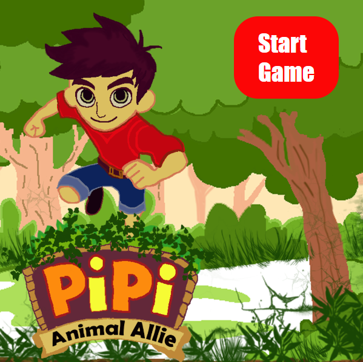
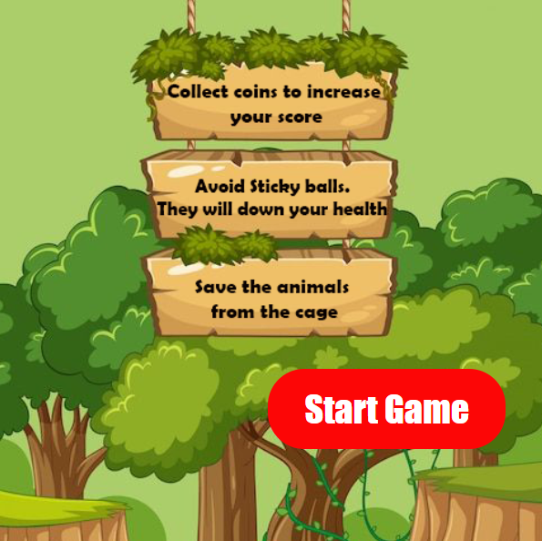
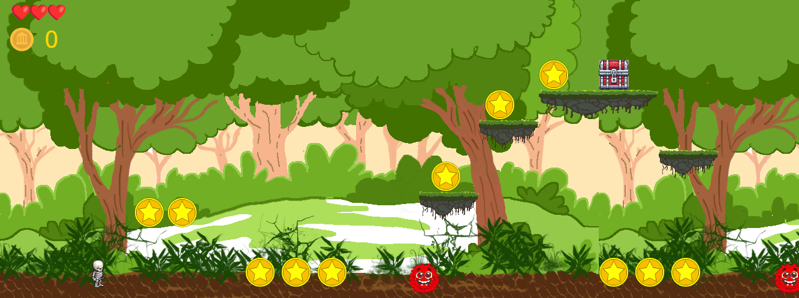
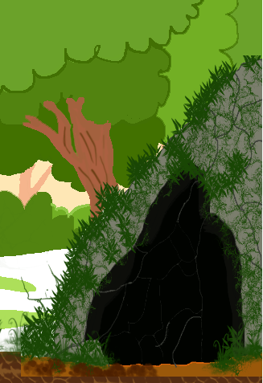
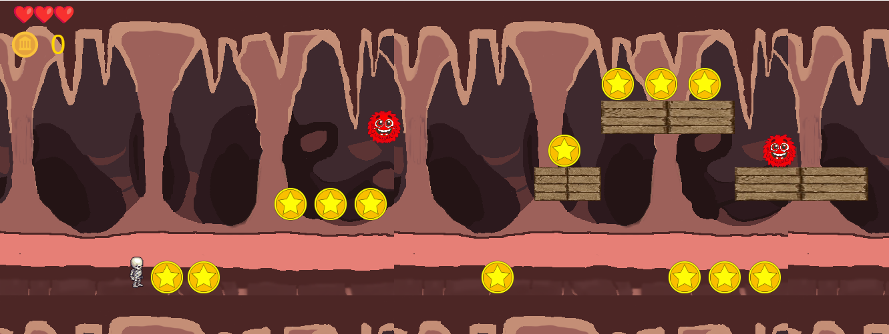
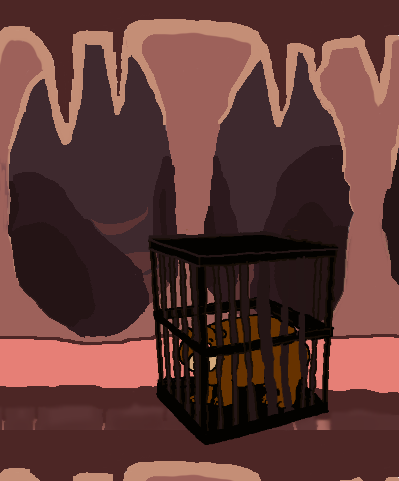
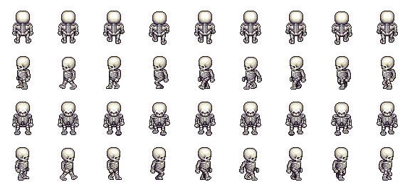

# 🎮 **Pipi- Animal Allies** 

> A 2D Platformer Adventure!
> Embark on an exciting platformer adventure where you control a brave skeleton navigating through challenging obstacles, collecting coins, and dodging deadly traps. Traverse through multiple levels. Your mission? Reach the endpoint and save the animal!
>
> --------------------------
>
>## 🌐 **Key Features**
✅ Dynamic Levels – Face increasing challenges as you progress.
✅ Gravity & Physics – Jump, move, and interact with objects realistically.
✅ Collectibles & Power-ups – Grab coins for points and mystery boxes for lives!
✅ Enemies & Hazards – Avoid stickyballs and other obstacles to survive.
✅ Engaging Storyline – Save the animal and become the hero!
>
>----------------------------
>
> ## 🎮 **Game Mechanics**
> ## Controls 
>

#### Move Right: Press 'D'
#### Move Left: Press 'A'
#### Jump: Press 'W'
>
> ## 🏃 Player Mechanics
#### The Pipi is the main character, capable of running, jumping, and interacting with objects.
#### Gravity affects the player, making jumps feel realistic.
#### Player has limited health (displayed as ❤️ hearts). Initial level of the health hearts is 3.Taking damage reduces health.
#### If health reaches zero, the game ends.
>
>## 🎯 Objectives
#### Reach the endpoint to progress through levels.
#### Collect coins (🪙) to increase score.
#### Interact with Mystery Boxes to gain power-ups or restore health.
#### Avoid Enemies like stickyballs, which move horizontally or vertically.
>
>## 🏆 Winning Condition
#### Successfully navigating to endpoint2 completes the game, displaying a victory message.

> ## 📸 **Screenshots**

> ### Start Page:

  
  
*Figure 1: Start Page*

---
> ### Rules Page:

  
  
*Figure 2: Rule Page*

---
### Main Gameplay (Level 01):

  
  
*Figure 3: Level 01 of the game.*

---
### End Point (Level 01):

  
  
*Figure 3: End Point of Level 01.*

---

### Main Gameplay (Level 02):

  
  
*Figure 4: Level 02 of the game.*

---
### End Point (Level 02):

  
  
*Figure 3: End Point of Level 02.*

---

## 🎨 **Spritesheets and Images**
Below are the sprites used to create characters and objects in the game:

### Player Character:

  
  
*Figure 4: Player character animations.*

---

### Enemy:

  
  
*Figure 5: Monster character.*

---
## ✍️ **Reflection**

### What went well:
- **Creative Design:** The game’s visual style and theme blended seamlessly, making the experience both engaging and immersive. Designing images was a fun and rewarding process.
- **Core Mechanics:** The gravity-based gameplay worked better than expected and provided a unique challenge.
- **Object designing** Successfully align all the game objects.

### Challenges:
- **Feature Limitations:** Some planned mechanics had to be shelved due to time constraints, requiring prioritization of essential gameplay elements.
- **Bug Fixes:** Handling collisions and edge cases for gravity mechanics was tricky.
- **Background Changes for levels:** This was quit difficult as i had to change level 02 in different way.

### Lessons Learned:
- **Prototyping Matters:** Testing early prototypes helped refine the core mechanics quickly.
- **Keep it Simple:** Prioritizing quality over quantity led to a more polished game, proving that a well-executed single feature is better than multiple unfinished ones.
- **Time Management is Key:** Breaking tasks into smaller milestones helped keep development on track. Prioritizing core features over extras ensured a functional and polished game.
- **Bug Fixing is an Ongoing Process:** No matter how well-planned, unexpected glitches and edge cases will arise. Testing across different scenarios was essential in refining the mechanics.
